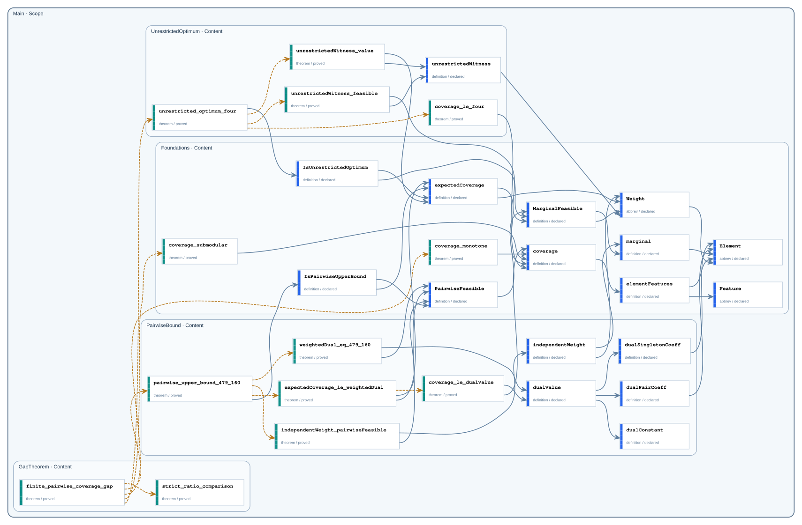

# Complete Declaration Graph

This catalog contains the current committed head of every active public and private declaration. It excludes deleted declarations and revision history.

- Declarations: `30`
- Public: `18`
- Private: `12`

## Dependency graph

The SVG may collapse duplicate Statement/Proof pairs for readability; the JSON document preserves both stage-specific edges.

## Declarations

| Node | Declaration | Visibility | Kind | Status |
| --- | --- | --- | --- | --- |
| `Main.GapTheorem` | [`finite_pairwise_coverage_gap`](declarations/main-gaptheorem-finite-pairwise-coverage-gap.md) | `public` | `theorem` | `proved` |
| `Main.GapTheorem` | [`strict_ratio_comparison`](declarations/main-gaptheorem-strict-ratio-comparison.md) | `private` | `theorem` | `proved` |
| `Main.PairwiseBound` | [`pairwise_upper_bound_479_160`](declarations/main-pairwisebound-pairwise-upper-bound-479-160.md) | `public` | `theorem` | `proved` |
| `Main.PairwiseBound` | [`expectedCoverage_le_weightedDual`](declarations/main-pairwisebound-expectedcoverage-le-weighteddual.md) | `private` | `theorem` | `proved` |
| `Main.PairwiseBound` | [`coverage_le_dualValue`](declarations/main-pairwisebound-coverage-le-dualvalue.md) | `private` | `theorem` | `proved` |
| `Main.PairwiseBound` | [`independentWeight_pairwiseFeasible`](declarations/main-pairwisebound-independentweight-pairwisefeasible.md) | `private` | `theorem` | `proved` |
| `Main.PairwiseBound` | [`independentWeight`](declarations/main-pairwisebound-independentweight.md) | `private` | `definition` | `declared` |
| `Main.PairwiseBound` | [`weightedDual_eq_479_160`](declarations/main-pairwisebound-weighteddual-eq-479-160.md) | `private` | `theorem` | `proved` |
| `Main.PairwiseBound` | [`dualValue`](declarations/main-pairwisebound-dualvalue.md) | `private` | `definition` | `declared` |
| `Main.PairwiseBound` | [`dualConstant`](declarations/main-pairwisebound-dualconstant.md) | `private` | `definition` | `declared` |
| `Main.PairwiseBound` | [`dualPairCoeff`](declarations/main-pairwisebound-dualpaircoeff.md) | `private` | `definition` | `declared` |
| `Main.PairwiseBound` | [`dualSingletonCoeff`](declarations/main-pairwisebound-dualsingletoncoeff.md) | `private` | `definition` | `declared` |
| `Main.UnrestrictedOptimum` | [`unrestricted_optimum_four`](declarations/main-unrestrictedoptimum-unrestricted-optimum-four.md) | `public` | `theorem` | `proved` |
| `Main.UnrestrictedOptimum` | [`coverage_le_four`](declarations/main-unrestrictedoptimum-coverage-le-four.md) | `public` | `theorem` | `proved` |
| `Main.UnrestrictedOptimum` | [`unrestrictedWitness_feasible`](declarations/main-unrestrictedoptimum-unrestrictedwitness-feasible.md) | `private` | `theorem` | `proved` |
| `Main.UnrestrictedOptimum` | [`unrestrictedWitness_value`](declarations/main-unrestrictedoptimum-unrestrictedwitness-value.md) | `private` | `theorem` | `proved` |
| `Main.UnrestrictedOptimum` | [`unrestrictedWitness`](declarations/main-unrestrictedoptimum-unrestrictedwitness.md) | `public` | `definition` | `declared` |
| `Main.Foundations` | [`IsPairwiseUpperBound`](declarations/main-foundations-ispairwiseupperbound.md) | `public` | `definition` | `declared` |
| `Main.Foundations` | [`IsUnrestrictedOptimum`](declarations/main-foundations-isunrestrictedoptimum.md) | `public` | `definition` | `declared` |
| `Main.Foundations` | [`PairwiseFeasible`](declarations/main-foundations-pairwisefeasible.md) | `public` | `definition` | `declared` |
| `Main.Foundations` | [`MarginalFeasible`](declarations/main-foundations-marginalfeasible.md) | `public` | `definition` | `declared` |
| `Main.Foundations` | [`coverage_monotone`](declarations/main-foundations-coverage-monotone.md) | `public` | `theorem` | `proved` |
| `Main.Foundations` | [`coverage_submodular`](declarations/main-foundations-coverage-submodular.md) | `public` | `theorem` | `proved` |
| `Main.Foundations` | [`expectedCoverage`](declarations/main-foundations-expectedcoverage.md) | `public` | `definition` | `declared` |
| `Main.Foundations` | [`Weight`](declarations/main-foundations-weight.md) | `public` | `abbrev` | `declared` |
| `Main.Foundations` | [`coverage`](declarations/main-foundations-coverage.md) | `public` | `definition` | `declared` |
| `Main.Foundations` | [`elementFeatures`](declarations/main-foundations-elementfeatures.md) | `public` | `definition` | `declared` |
| `Main.Foundations` | [`Feature`](declarations/main-foundations-feature.md) | `public` | `abbrev` | `declared` |
| `Main.Foundations` | [`marginal`](declarations/main-foundations-marginal.md) | `public` | `definition` | `declared` |
| `Main.Foundations` | [`Element`](declarations/main-foundations-element.md) | `public` | `abbrev` | `declared` |
