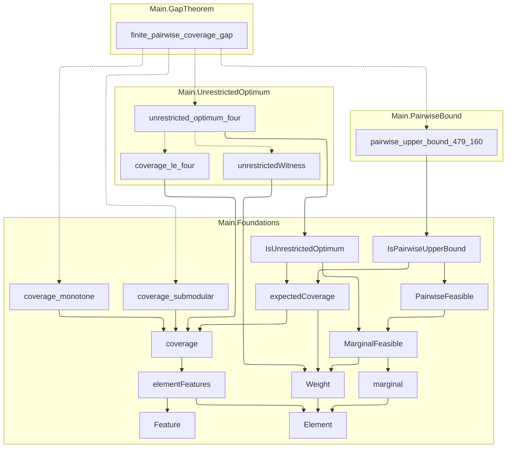

# Public API

- Repository completion: `graph_proved`
- Proof availability: `proved`
- Public declarations: `18` across `4` nodes

## Dependency graph

Consumers appear above the public declarations they depend on. Solid arrows are Statement dependencies; dashed arrows are Proof dependencies. Transitively implied edges are omitted for readability; each declaration page lists the complete direct dependency set. Mathlib and non-public project dependencies are not shown.

## Declarations

| Node | Declaration | Kind | Status |
| --- | --- | --- | --- |
| `Main.GapTheorem` | [`finite_pairwise_coverage_gap`](public-api/main-gaptheorem-finite-pairwise-coverage-gap.md) | `theorem` | `proved` |
| `Main.PairwiseBound` | [`pairwise_upper_bound_479_160`](public-api/main-pairwisebound-pairwise-upper-bound-479-160.md) | `theorem` | `proved` |
| `Main.UnrestrictedOptimum` | [`unrestricted_optimum_four`](public-api/main-unrestrictedoptimum-unrestricted-optimum-four.md) | `theorem` | `proved` |
| `Main.UnrestrictedOptimum` | [`coverage_le_four`](public-api/main-unrestrictedoptimum-coverage-le-four.md) | `theorem` | `proved` |
| `Main.UnrestrictedOptimum` | [`unrestrictedWitness`](public-api/main-unrestrictedoptimum-unrestrictedwitness.md) | `definition` | `declared` |
| `Main.Foundations` | [`IsPairwiseUpperBound`](public-api/main-foundations-ispairwiseupperbound.md) | `definition` | `declared` |
| `Main.Foundations` | [`IsUnrestrictedOptimum`](public-api/main-foundations-isunrestrictedoptimum.md) | `definition` | `declared` |
| `Main.Foundations` | [`PairwiseFeasible`](public-api/main-foundations-pairwisefeasible.md) | `definition` | `declared` |
| `Main.Foundations` | [`MarginalFeasible`](public-api/main-foundations-marginalfeasible.md) | `definition` | `declared` |
| `Main.Foundations` | [`coverage_monotone`](public-api/main-foundations-coverage-monotone.md) | `theorem` | `proved` |
| `Main.Foundations` | [`coverage_submodular`](public-api/main-foundations-coverage-submodular.md) | `theorem` | `proved` |
| `Main.Foundations` | [`expectedCoverage`](public-api/main-foundations-expectedcoverage.md) | `definition` | `declared` |
| `Main.Foundations` | [`Weight`](public-api/main-foundations-weight.md) | `abbrev` | `declared` |
| `Main.Foundations` | [`coverage`](public-api/main-foundations-coverage.md) | `definition` | `declared` |
| `Main.Foundations` | [`elementFeatures`](public-api/main-foundations-elementfeatures.md) | `definition` | `declared` |
| `Main.Foundations` | [`Feature`](public-api/main-foundations-feature.md) | `abbrev` | `declared` |
| `Main.Foundations` | [`marginal`](public-api/main-foundations-marginal.md) | `definition` | `declared` |
| `Main.Foundations` | [`Element`](public-api/main-foundations-element.md) | `abbrev` | `declared` |
