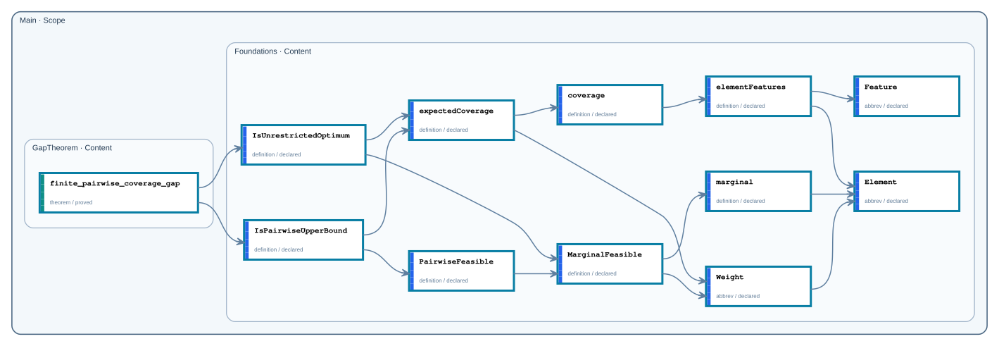

# Public API

- Repository format: `native`
- Repository completion: `graph_proved`
- Proof availability: `proved`
- Public declarations: `12` across `2` nodes

## Dependency graph

Arrows run from each consumer to the public declarations it depends on. Solid arrows are Statement dependencies; dashed arrows are Proof dependencies. Transitively implied edges are omitted for readability; each declaration page lists the complete direct dependency set. Mathlib and non-public project dependencies are not shown.

## Declarations

| Node | Declaration | Kind | Status |
| --- | --- | --- | --- |
| `Main.GapTheorem` | [`finite_pairwise_coverage_gap`](declarations/main-gaptheorem-finite-pairwise-coverage-gap.md) | `theorem` | `proved` |
| `Main.Foundations` | [`IsPairwiseUpperBound`](declarations/main-foundations-ispairwiseupperbound.md) | `definition` | `declared` |
| `Main.Foundations` | [`IsUnrestrictedOptimum`](declarations/main-foundations-isunrestrictedoptimum.md) | `definition` | `declared` |
| `Main.Foundations` | [`PairwiseFeasible`](declarations/main-foundations-pairwisefeasible.md) | `definition` | `declared` |
| `Main.Foundations` | [`MarginalFeasible`](declarations/main-foundations-marginalfeasible.md) | `definition` | `declared` |
| `Main.Foundations` | [`expectedCoverage`](declarations/main-foundations-expectedcoverage.md) | `definition` | `declared` |
| `Main.Foundations` | [`Weight`](declarations/main-foundations-weight.md) | `abbrev` | `declared` |
| `Main.Foundations` | [`coverage`](declarations/main-foundations-coverage.md) | `definition` | `declared` |
| `Main.Foundations` | [`elementFeatures`](declarations/main-foundations-elementfeatures.md) | `definition` | `declared` |
| `Main.Foundations` | [`Feature`](declarations/main-foundations-feature.md) | `abbrev` | `declared` |
| `Main.Foundations` | [`marginal`](declarations/main-foundations-marginal.md) | `definition` | `declared` |
| `Main.Foundations` | [`Element`](declarations/main-foundations-element.md) | `abbrev` | `declared` |
