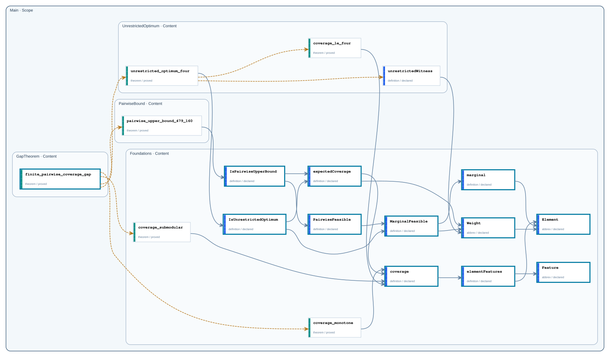

# Public Boundaries

This catalog shows every Content-public declaration and how it is selectively propagated through Scope boundaries. Only declarations exported through `Main` belong to the repository Public API.

- Content-public declarations: `18`
- Main exports: `12`

## Boundary graph

Solid gray arrows are Statement dependencies; dashed amber arrows are Proof dependencies. A thick teal declaration frame marks a Main export; compact upward labels record intermediate Scope exports.

## Declarations

| Node | Declaration | Kind | Status | Exported through | Main API |
| --- | --- | --- | --- | --- | --- |
| `Main.GapTheorem` | [`finite_pairwise_coverage_gap`](declarations/main-gaptheorem-finite-pairwise-coverage-gap.md) | `theorem` | `proved` | `Main` | yes |
| `Main.PairwiseBound` | [`pairwise_upper_bound_479_160`](declarations/main-pairwisebound-pairwise-upper-bound-479-160.md) | `theorem` | `proved` | — | no |
| `Main.UnrestrictedOptimum` | [`unrestricted_optimum_four`](declarations/main-unrestrictedoptimum-unrestricted-optimum-four.md) | `theorem` | `proved` | — | no |
| `Main.UnrestrictedOptimum` | [`coverage_le_four`](declarations/main-unrestrictedoptimum-coverage-le-four.md) | `theorem` | `proved` | — | no |
| `Main.UnrestrictedOptimum` | [`unrestrictedWitness`](declarations/main-unrestrictedoptimum-unrestrictedwitness.md) | `definition` | `declared` | — | no |
| `Main.Foundations` | [`IsPairwiseUpperBound`](declarations/main-foundations-ispairwiseupperbound.md) | `definition` | `declared` | `Main` | yes |
| `Main.Foundations` | [`IsUnrestrictedOptimum`](declarations/main-foundations-isunrestrictedoptimum.md) | `definition` | `declared` | `Main` | yes |
| `Main.Foundations` | [`PairwiseFeasible`](declarations/main-foundations-pairwisefeasible.md) | `definition` | `declared` | `Main` | yes |
| `Main.Foundations` | [`MarginalFeasible`](declarations/main-foundations-marginalfeasible.md) | `definition` | `declared` | `Main` | yes |
| `Main.Foundations` | [`coverage_monotone`](declarations/main-foundations-coverage-monotone.md) | `theorem` | `proved` | — | no |
| `Main.Foundations` | [`coverage_submodular`](declarations/main-foundations-coverage-submodular.md) | `theorem` | `proved` | — | no |
| `Main.Foundations` | [`expectedCoverage`](declarations/main-foundations-expectedcoverage.md) | `definition` | `declared` | `Main` | yes |
| `Main.Foundations` | [`Weight`](declarations/main-foundations-weight.md) | `abbrev` | `declared` | `Main` | yes |
| `Main.Foundations` | [`coverage`](declarations/main-foundations-coverage.md) | `definition` | `declared` | `Main` | yes |
| `Main.Foundations` | [`elementFeatures`](declarations/main-foundations-elementfeatures.md) | `definition` | `declared` | `Main` | yes |
| `Main.Foundations` | [`Feature`](declarations/main-foundations-feature.md) | `abbrev` | `declared` | `Main` | yes |
| `Main.Foundations` | [`marginal`](declarations/main-foundations-marginal.md) | `definition` | `declared` | `Main` | yes |
| `Main.Foundations` | [`Element`](declarations/main-foundations-element.md) | `abbrev` | `declared` | `Main` | yes |
